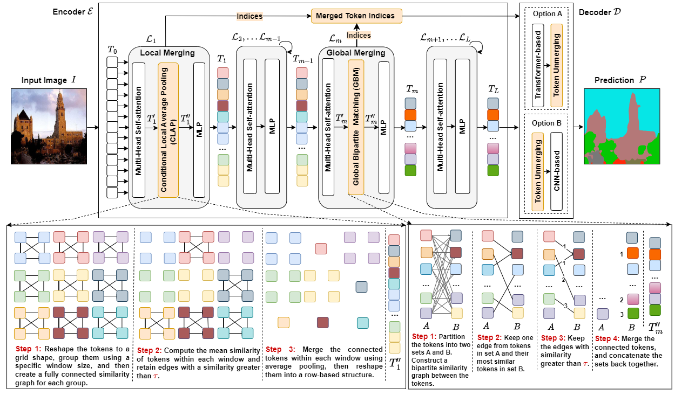

# ALGM: Adaptive Local-then-Global Token Merging for Efficient Semantic Segmentation with Plain Vision Transformers (CVPR 2024)


## [[Project page](https://tue-mps.github.io/ALGM/)] [[Paper](https://tue-mps.github.io/ALGM/paper/ALGM__Adaptive_Local_Global_Token_Merging_for_Efficient_Semantic_Segmentation_in_Vision_Transformers_CVPR2024.pdf)]



"[ALGM: Adaptive Local-then-Global Token Merging for Efficient Semantic Segmentation with Plain Vision Transformers](https://openaccess.thecvf.com/content/CVPR2024/html)", by Narges Norouzi, Svetlana Orlova, Daan de Geus, and Gijs Dubbelman, CVPR 2024.

## ALGM applied to Segmenter

In this repository, Adaptive Local-then-Global Token Merging (ALGM) is applied to
[Segmenter: Transformer for Semantic Segmentation](https://arxiv.org/abs/2105.05633)
by Robin Strudel*, Ricardo Garcia*, Ivan Laptev and Cordelia Schmid, ICCV 2021.

The provided code extends the [original code for Segmenter](https://github.com/rstrudel/segmenter).

## Installation

Installation follows the installation of the original Segmenter code. Specifically: define os environment variables pointing to your checkpoint and dataset directory, put in your `.bashrc`:

```bash
export DATASET=/path/to/dataset/dir
```
**1. Clone the repo**

``` bash
git clone https://github.com/tue-mps/algm-segmenter.git
cd algm-segmenter
```

**2. Setting up the virtualenv**

Install [PyTorch](https://pytorch.org/) (>= 1.13.1 # For scatter_reduce).

``` bash
# create environment
conda create -n algm python==3.10
conda activate algm
# install pytorch with cuda
conda install pytorch==1.13.1 torchvision==0.14.1 torchaudio==0.13.1 pytorch-cuda=11.7 -c pytorch -c nvidia
# install required packages
pip install -r requirements.txt
```

**3. Setting up the ALGM package**

``` bash
cd algm
# set up the ALGM package
python setup.py build develop
```

**4. Prepare the datasets**
To download ADE20K, use the following command:
```bash
python -m segm.scripts.prepare_ade20k $DATASET
```

Similar preparation scripts also exist for [Cityscapes](segm/scripts/prepare_cityscapes.py) and [Pascal-Context](segm/scripts/prepare_pcontext.py).

## Training

To train Segmenter + ALGM using `ViT-S/16` with specific configurations on the `ADE20K` dataset, use the command provided below. The model is configured to apply ALGM at layers 1 and 5, with a merging window size of 2x2 and a threshold of 0.88.

```bash
python -m segm.train  --log-dir runs/vit_small_layers_1_5_T_0.88/ \
                      --dataset ade20k \
                      --backbone vit_small_patch16_384 \
                      --decoder mask_transformer \
                      --patch-type algm \
                      --selected-layers 1 5 \
                      --merging-window-size 2 2 \
                      --threshold 0.88 
```

For more examples of training commands, see [TRAINING](./TRAINING.md).

## Inference
To perform an evaluation using Segmenter + ALGM on ADE20K, execute the following command. Ensure you replace `path_to_checkpoint.pth` with the actual path to your checkpoint file. Additionally, make sure the `variant.yaml` file is located in the same directory as your checkpoint file. For additional examples covering all available backbones and datasets, refer to the `jobs` directory. 

**Note:** Please use the specific values for the `selected-layers` and `threshold` options for each backbone. You can find these values in the `variant.yaml` file.


```bash
# single-scale baseline evaluation:
python -m segm.eval.miou path_to_checkpoint.pth \
          ade20k \
          --singlescale \
          --patch-type pure 

# Explanation:
# --singlescale: Evaluates the model using a single scale of input images.
# --patch-type pure: Uses the standard patch processing without any modifications.

# single-scale baseline + ALGM evaluation:
python -m segm.eval.miou path_to_checkpoint.pth \
          ade20k \
          --singlescale \
          --patch-type algm \
          --selected-layers 1 5  \
          --merging-window-size 2 2 \
          --threshold 0.88

# Explanation:
# --patch-type algm: Applies the ALGM patch type.
# --selected-layers 1 5: Specifies which layers of the network to apply ALGM. In this case, layers 1 and 5.
# --merging-window-size 2 2: Sets the size of the merging window for the ALGM algorithm, here it is 2x2.
# --threshold 0.90: Sets the confidence threshold for merging patches in ALGM, where 0.90 stands for 90% confidence.

```

## Benchmarking

To calculate the Im/Sec and GFLOPs, execute the following commands. Again, ensure you replace `path_to_checkpoint_directory` with the actual path to your checkpoint file. Additionally, make sure the `variant.yaml` file is located in the same directory as your checkpoint file.

**Note:** Please use the specific values for the `selected-layers` and `threshold` options for each backbone. You can find these values in the `variant.yaml` file.

```bash

# Im/sec
python -m segm.speedtest --model-dir path_to_checkpoint_directory \
        --dataset ade20k \
        --batch-size 1 \
        --patch-type algm \
        --selected-layers 1 5 \
        --merging-window-size 2 2 \
        --threshold 0.88

# GFLOPs
python -m segm.flops --model-dir path_to_checkpoint_directory \
          --dataset ade20k \
          --batch-size 1 \
          --patch-type algm \
          --selected-layers 1 5 \
          --merging-window-size 2 2 \
          --threshold 0.88

```

## Results and Models

Below, we provide the results for different network settings and datasets. 

### ADE20K

Segmenter models with ViT backbone:
<table>
  <tr>
    <th>Backbone</th>
    <th>Crop size</th>
    <th>mIoU</th>
    <th>Im/sec (BS=32)</th>
    <th>GFLOPs</th>
    <th colspan="2">Download</th>
  </tr>
<tr>
    <td>ViT-Ti/16</td>
    <td>512x512</td>
    <td>38.1</td>
    <td>287</td>
    <td>12.8</td>
    <td><a href="https://www.rocq.inria.fr/cluster-willow/rstrudel/segmenter/checkpoints/ade20k/seg_tiny_mask/checkpoint.pth">model</a></td>
    <td><a href="https://www.rocq.inria.fr/cluster-willow/rstrudel/segmenter/checkpoints/ade20k/seg_tiny_mask/variant.yml">config</a></td>
</tr>
<tr>
    <td>ViT-Ti/16 + ALGM </td>
    <td>512x512</td>
    <td>38.9</td>
    <td>388</td>
    <td>8.4</td>
    <td><a href="https://drive.google.com/file/d/1nEYRZuAGTeTBD_iLAkNZIx6Pn1Mw9KOW/view?usp=sharing">model</a></td>
    <td><a href="https://drive.google.com/file/d/1e_xDX1EO_JRyypRt6b3L6KaPHkk1d9p9/view?usp=sharing">config</a></td>
</tr>
<tr>
    <td>ViT-S/16</td>
    <td>512x512</td>
    <td>45.3</td>
    <td>134</td>
    <td>38.6</td>
    <td><a href="https://www.rocq.inria.fr/cluster-willow/rstrudel/segmenter/checkpoints/ade20k/seg_small_mask/checkpoint.pth">model</a></td>
    <td><a href="https://www.rocq.inria.fr/cluster-willow/rstrudel/segmenter/checkpoints/ade20k/seg_small_mask/variant.yml">config</a></td>
</tr>
<tr>
    <td>ViT-S/16 + ALGM</td>
    <td>512x512</td>
    <td>46.4</td>
    <td>192</td>
    <td>26.3</td>
    <td><a href="https://drive.google.com/file/d/1bPAu8ej0p1ypubbpFN5hJ-EyC-rCCdsw/view?usp=sharing">model</a></td>
    <td><a href="https://drive.google.com/file/d/1YXe4seEaKKhoaevCveRAktnmkSFMfOaW/view?usp=sharing">config</a></td>
</tr>
<tr>
    <td>ViT-B/16</td>
    <td>512x512</td>
    <td>48.5</td>
    <td>51</td>
    <td>130</td>
    <td><a href="https://www.rocq.inria.fr/cluster-willow/rstrudel/segmenter/checkpoints/ade20k/seg_base_mask/checkpoint.pth">model</a></td>
    <td><a href="https://www.rocq.inria.fr/cluster-willow/rstrudel/segmenter/checkpoints/ade20k/seg_base_mask/variant.yml">config</a></td>
</tr>
<tr>
    <td>ViT-B/16 + ALGM </td>
    <td>512x512</td>
    <td>49.4</td>
    <td>73</td>
    <td>91</td>
    <td><a href="https://drive.google.com/file/d/1A72LVOPZ5DME7MNyF_wDzruyb-ebjXlB/view?usp=sharing">model</a></td>
    <td><a href="https://drive.google.com/file/d/1frlGUQe6aJbQdQeNqTDOST8naOdd2uJq/view?usp=sharing">config</a></td>
</tr>
<tr>
    <td>ViT-L/16</td>
    <td>640x640</td>
    <td>51.8</td>
    <td>10</td>
    <td>672</td>
    <td><a href="https://www.rocq.inria.fr/cluster-willow/rstrudel/segmenter/checkpoints/ade20k/seg_large_mask_640/checkpoint.pth">model</a></td>
    <td><a href="https://www.rocq.inria.fr/cluster-willow/rstrudel/segmenter/checkpoints/ade20k/seg_large_mask_640/variant.yml">config</a></td>
</tr>
<tr>
    <td>ViT-L/16 + ALGM </td>
    <td>640x640</td>
    <td>52.7</td>
    <td>16</td>
    <td>438</td>
    <td><a href="https://drive.google.com/file/d/1B4SluuRZOe-BgU0P19od4Jk-_-TofeCw/view?usp=sharing">model</a></td>
    <td><a href="https://drive.google.com/file/d/1zOw3mNdi4T2US3YqA2V8-TesHbowm1z-/view?usp=sharing">config</a></td>
</tr>
</table>


### Pascal Context
<table>
  <tr>
    <th>Backbone</th>
    <th>Crop size</th>
    <th>mIoU</th>
    <th>Im/sec (BS=32)</th>
    <th>GFLOPs</th>
    <th colspan="2">Download</th>
  </tr>
<tr>
    <td>ViT-S/16</td>
    <td>480x480</td>
    <td>53.0</td>
    <td>172</td>
    <td>32.1</td>
    <td><a href="https://drive.google.com/file/d/1lrs0frcaDFqirq-A6qCDDk4ogO3232Y4/view?usp=sharing">model</a></td>
    <td><a href="https://drive.google.com/file/d/1bkN0jSsAQ5XSnygWKYUJEeT0NkdKOlQA/view?usp=sharing">config</a></td>
</tr>
<tr>
    <td>ViT-S/16 + ALGM </td>
    <td>480x480</td>
    <td>53.2</td>
    <td>217</td>
    <td>24.6</td>
    <td><a href="https://drive.google.com/file/d/1wulOQG4z4vFsM11kZo32h9aHntRMIoof/view?usp=sharing">model</a></td>
    <td><a href="https://drive.google.com/file/d/1uh6Hg0e3wjcWKl_YQcdAFdsIlR_wnsy-/view?usp=sharing">config</a></td>
</tr>
</table>

### Cityscapes
<table>
  <tr>
    <th>Backbone</th>
    <th>Crop size</th>
    <th>mIoU</th>
    <th>Im/sec (BS=32)</th>
    <th>GFLOPs</th>
    <th colspan="2">Download</th>
  </tr>
<tr>
    <td>ViT-S/16</td>
    <td>768x768</td>
    <td>76.5</td>
    <td>41</td>
    <td>116</td>
    <td><a href="https://drive.google.com/file/d/1CcO4Aorccv9t5bA9FULpCKtKuDhwRiEe/view?usp=sharing">model</a></td>
    <td><a href="https://drive.google.com/file/d/1K--NpbSF7pTrCsG3OByCg87cKQiPdXpN/view?usp=sharing">config</a></td>
</tr>
<tr>
    <td>ViT-S/16 + ALGM </td>
    <td>768x768</td>
    <td>76.9</td>
    <td>65</td>
    <td>76</td>
    <td><a href="https://drive.google.com/file/d/1-blLT5QAxj0CHvNF4JNfzHRsEVJ0uh8z/view?usp=sharing">model</a></td>
    <td><a href="https://drive.google.com/file/d/15UMM6dgZMLh4mMHcwoCYcBou-lm1UEte/view?usp=sharing">config</a></td>
</tr>
</table>


## Upcoming Features 


```
- [x] Training and Inference code
- [x] Flops and Speedtest code
- [ ] ViT-Large checkpoints for Cityscapes and Pascal-Context datasets
- [ ] COCO-Stuff dataset support
- [ ] Code for merging visulization 


```
## BibTex

```
@inproceedings{norouzi2024algm,
  title={{ALGM: Adaptive Local-then-Global Token Merging for Efficient Semantic Segmentation with Plain Vision Transformers}},
  author={Norouzi, Narges and Sorlova, Svetlana and {de Geus}, Daan and Dubbelman, Gijs},
  booktitle={IEEE/CVF Conference on Computer Vision and Pattern Recognition (CVPR)},
  year={2024}
}
```


## Acknowledgements

This code uses the [ToMe](https://github.com/facebookresearch/ToMe) repository for implementing the global merging module and extends the official [Segmenter](https://github.com/rstrudel/segmenter) code. The Vision Transformer code in the original repository is based on [timm](https://github.com/rwightman/pytorch-image-models) library and the semantic segmentation training and evaluation pipelines are based on [mmsegmentation](https://github.com/open-mmlab/mmsegmentation).
